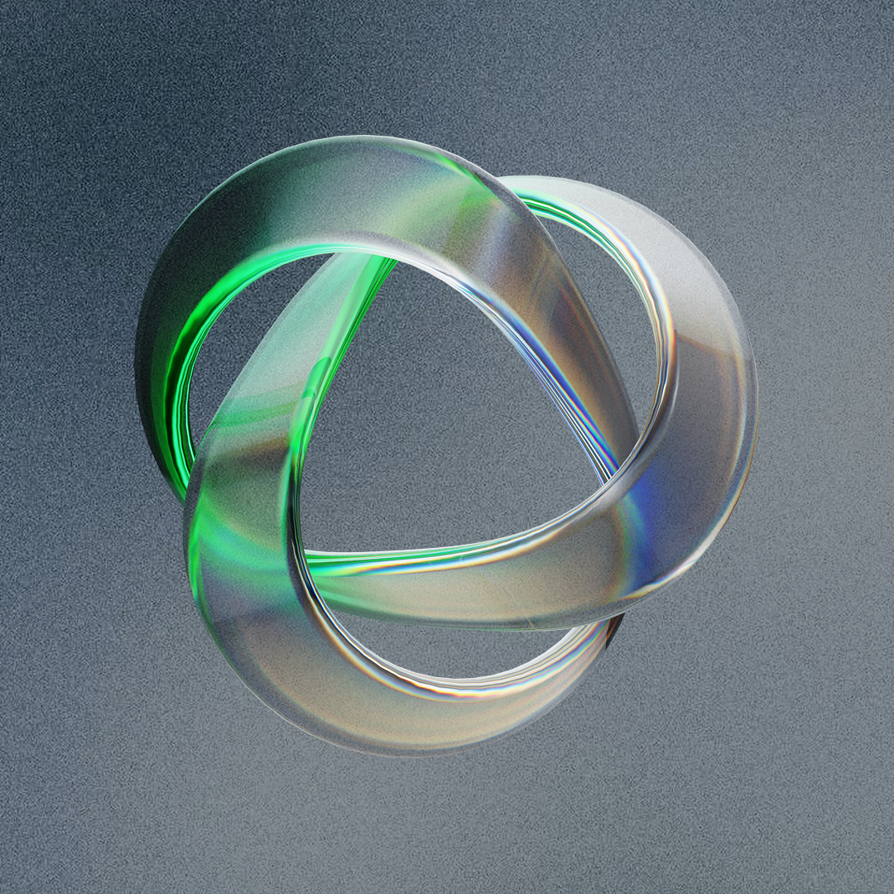

# Musa

<p align="center">
  
</p>

A controller-friendly music player for your own library.

Musa is built with Go + Raylib and is designed around browsing albums, enjoying cover art, and moving through your music with a clean, console-like feel.

## Install

### macOS

From anywhere:

```bash
go install github.com/katistix/musa/cmd/musa-install@latest && $(go env GOPATH)/bin/musa-install
```

This creates a standalone app bundle at:

```text
~/Applications/Musa.app
```

Then launch it with Finder, Spotlight, or:

```bash
open ~/Applications/Musa.app
```

## Run in development

```bash
go run .
```

## Features

- scans `~/Music`
- album-first browsing
- search and cover art
- controller-friendly navigation
- Now Playing view with waveform
- remembers last album, track, and playback position
- restores paused where you left off

## Notes

- On macOS, the installer creates a real `.app` bundle instead of leaving you with a console executable.
- Musa stores its playback state in:

```text
~/.musa-state.json
```
